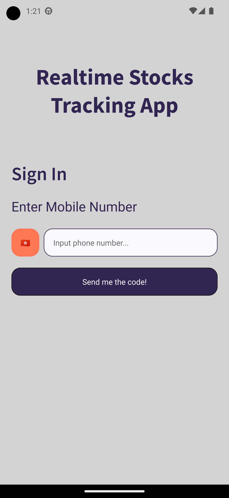
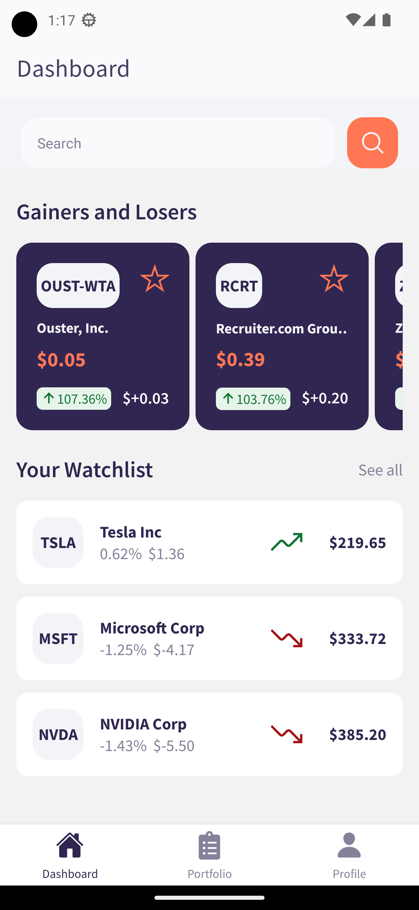
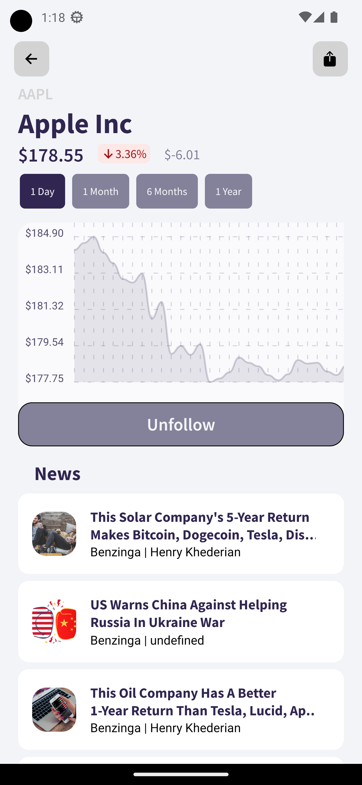
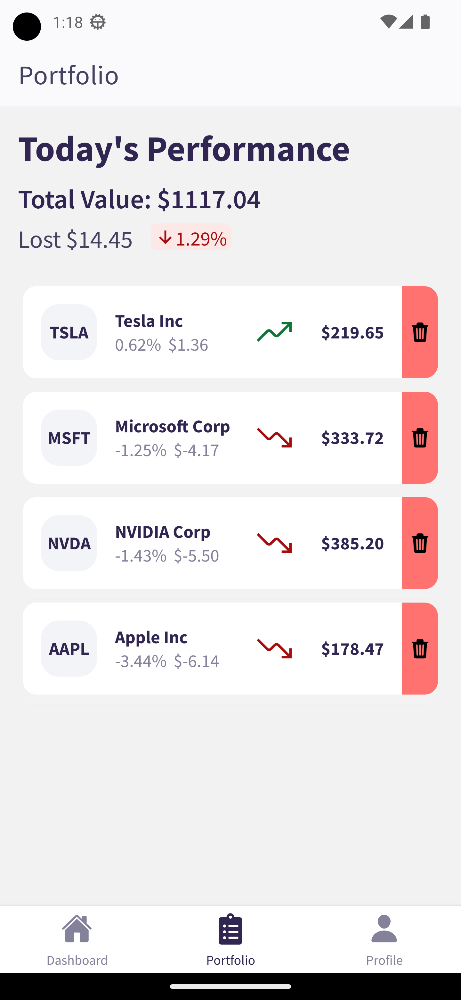
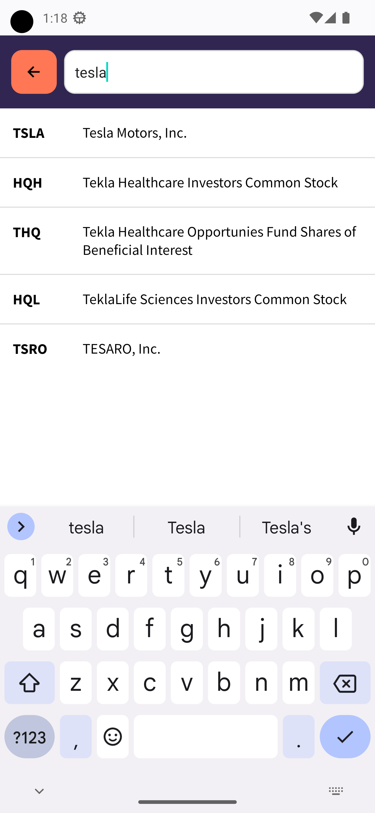
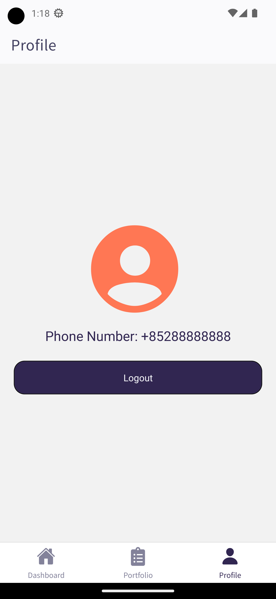

# RealTime Stock Tracking App

## 📃 Prerequisites

- If you want to replicate this project you will need to create a [Firebase](https://firebase.google.com/) and [Algolia](https://www.algolia.com/) free account
  - On firebase you will need to enable phone authentication and the firestore database
  - On Algolia create and application and a “all-stock” named index where the entries are the “symbol”, “company_name” and “exchange” of the stocks
  - You will also need free api keys from [Alpha Vantage](https://www.alphavantage.co/), [Rapid API](https://rapidapi.com/twelvedata/api/twelve-data1) and [Financial Modeling](https://site.financialmodelingprep.com/developer/docs/)
- Create an environment variables(.env) file with these keys (these are sample keys)
  - ALPHA_VANTAGE_KEY=MZMSDME9TW32TYEV
  - RAPID_API_KEY=MZMSDME9TW32TYEV
  - FINANCIALMODELING_API_KEY=MZMSDME9TW32TYEV
  - FIREBASE_API_KEY=MZMSDME9TW32TYEV
  - FIREBASE_SENDER_ID=MZMSDME9TW32TYEV
  - FIREBASE_APP_ID=MZMSDME9TW32TYEV
  - FIREBASE_MEASUREMENT_ID=MZMSDME9TW32TYEV
  - ALGOLIA_APP_API=MZMSDME9TW32TYEV
  - ALGOLIA_API_KEY=MZMSDME9TW32TYEV

## 🚀 How to use

```sh
npm install
```

```sh
npm start
```

Running “npm start” will start expo and give you the options to scan to qr code to run the application with the “Expo” app on your phone or run it with android or ios simulators.

## 📷 Screens

 
 
 

## 📝 Extra Notes

- [Expo Router: Docs](https://expo.github.io/router)
- [Expo Router: Repo](https://github.com/expo/router)
